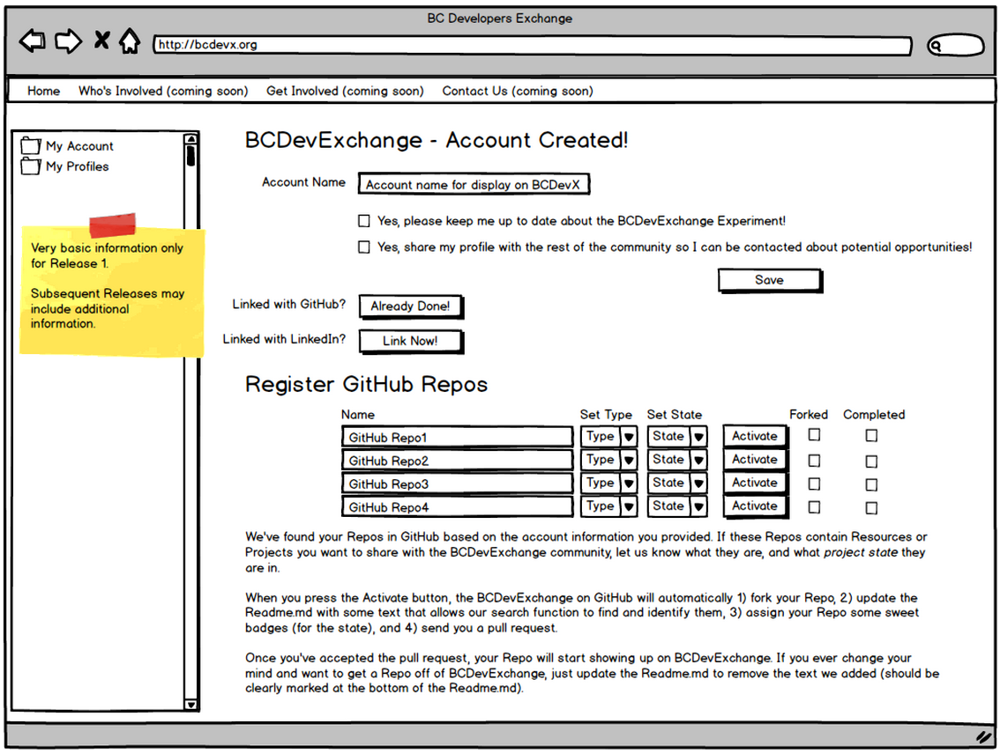

---
[Back to Discussion Index](../discussion_index.md)

## Accounts
BCDevExchange will support the creation and maintenance of user accounts. 

**Release 1:** We are exploring the idea of creating BCDevExchange accounts via existing GitHub accounts and LinkedIn accounts for context and authentication. Users will be able to create an initial BCDevExchange account through either of these, and then **(Future Release)** link the other one after the fact (for example, sign up with GitHub, then subsequently tie in the LinkedIn account). Once associated with BCDevExchange, users can then log in using either GitHub or LinkedIn. Subsequent releases may allow the use of additional identity providers and authentication services. Upon the creation of the BCDevExchange account, the user will have a single Profile associated with it (their individual profile).

**Future State:** Each account will reflect a single person / user, but can have multiple associated profiles to indicate the different contexts from which the person is interacting with BCDevExchange. For example, a BCDevExchange account may have a single Individual profile, as well as multiple Organization specific profiles (each derived from their association with an Organization). Certain core information is shared between all profiles, and maintained against the core account itself, while other information is profile specific, and not shared between profiles. These concepts and data relationships are expected to evolve  over time as functionality is rolled out. 

Users need to be able to sign in and sign out of BCDevExchange. When signing in, they should be prompted to define the context of their current session, allowing them to choose between the different profiles associated with their account. This sign in context will impact how they interact with features within BCDevExchange, such as defaulting the owner of newly created resources, or what sort of profile maintenance functions they have access to. Users should be able to swap contexts within a signed in session, without having to first sign out.

###Mockups

The sign up process is expected to be handled either through an existing GitHub account or an existing LinkedIn account. A minimum amount of information is intended to be stored by BCDevExchange (just enough to allow subsequent log ins). Sign Up using GitHub is expected to be available in **Release 1**, while Sign Up via LinkedIn may be available only in a **Future Release**.   

Linking repos is being considered for a future release, allowing members of BCDevExchange to self register and maintain projects and resources (via GitHub repos).

