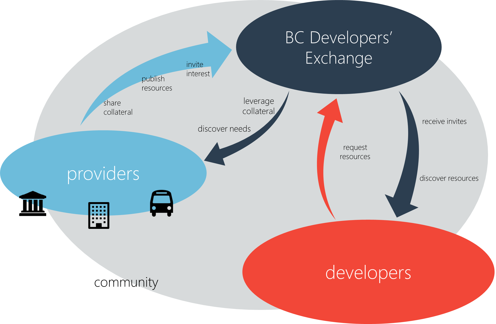
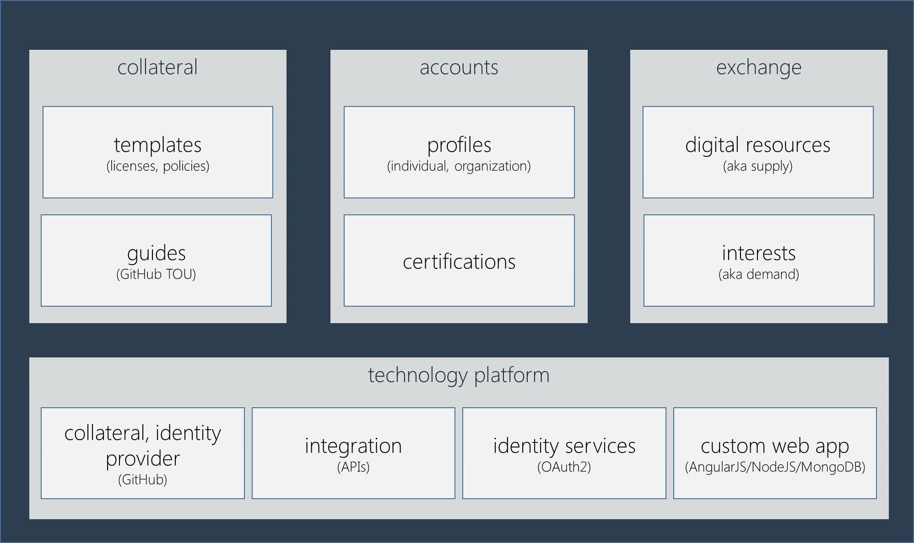
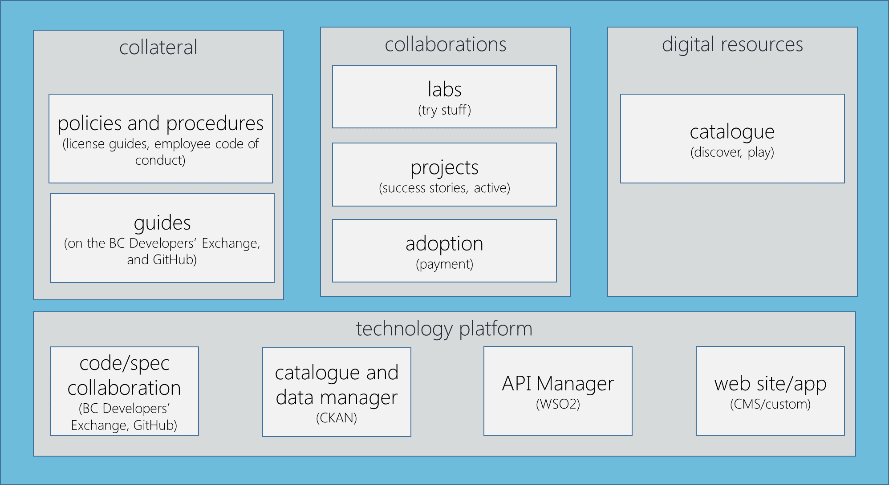
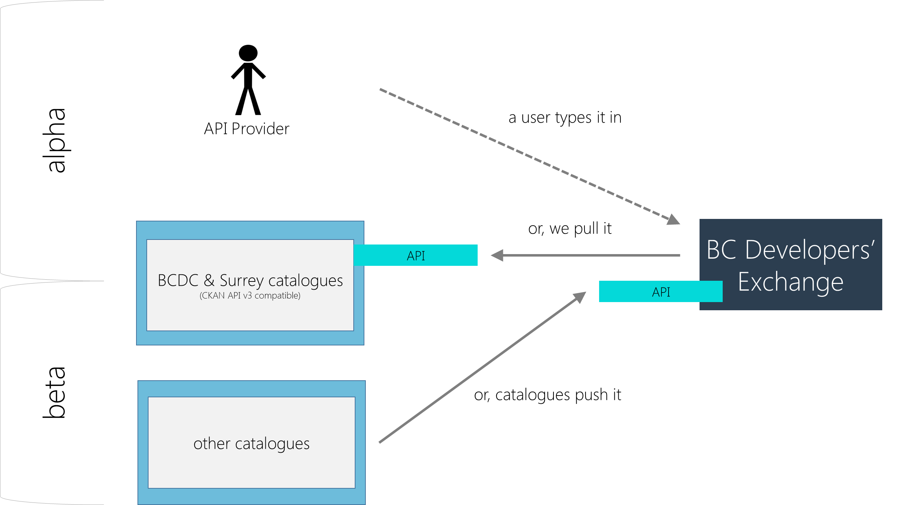
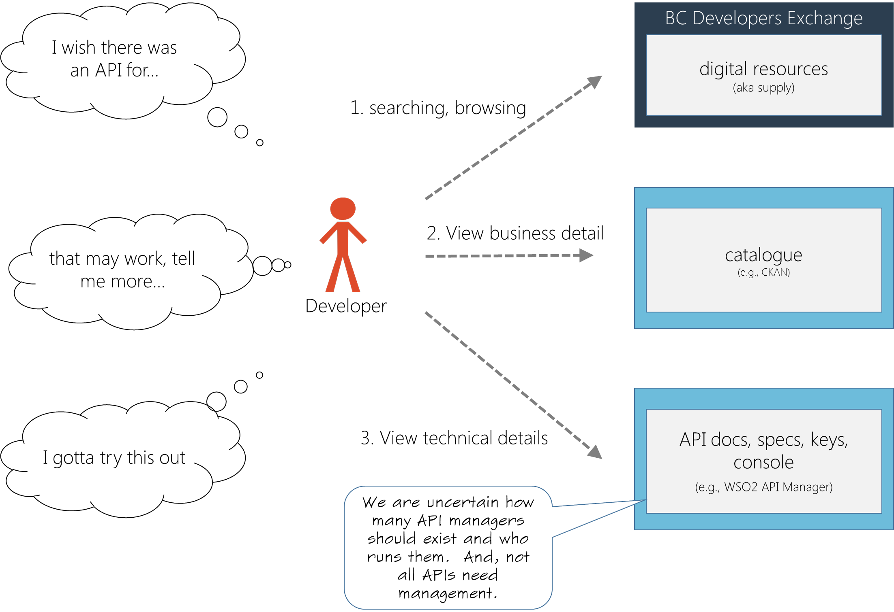
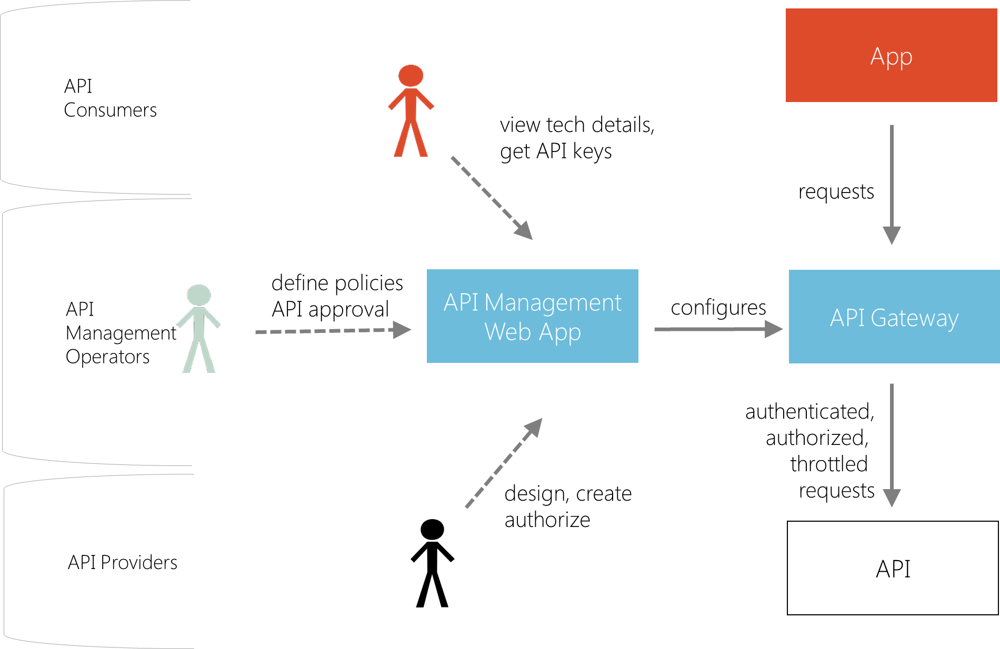
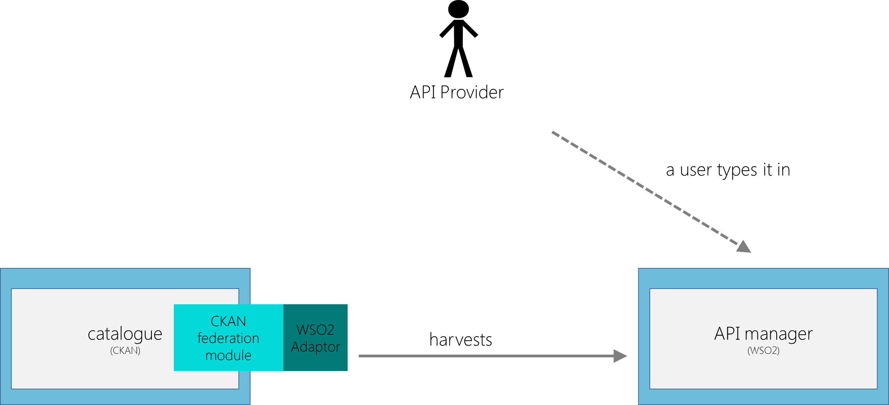
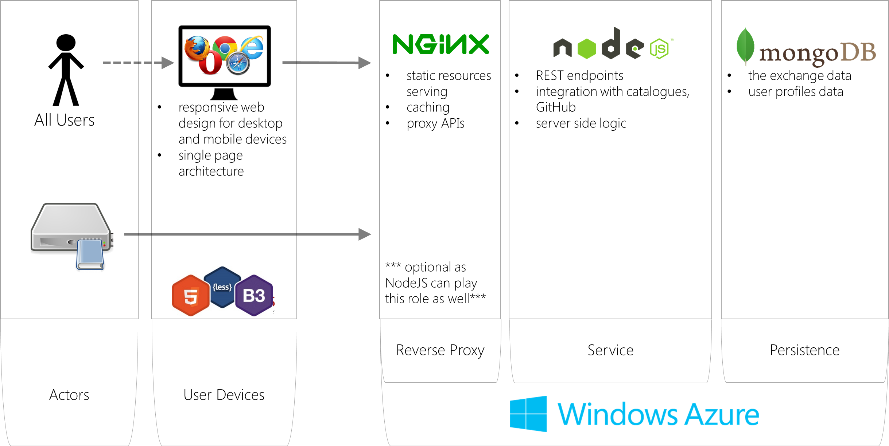

---
[Back to Discussion Index](../discussion_index.md)

The contents of this page were taken from an architecture document produced in February, 2015.

----
###Purpose

To communicate ideas about target solutions.  In this document we will describe the solutions for the BC Developers’ Exchange project.  The solution spans from the BC Developers’ Exchange to BC Government components.  Why?  Because, the project needs to know where we are going and if it’s the right thing to build.  

###Read Time

10-30 minutes
 
###Process

**Where did all this come from?**  
This is the result and ongoing process of listening to the product owners, subject matter experts and user groups.  

**What’s next?**
This is not the first iteration of BC Developers’ Exchange, nor the last.  This is [Discovery](projectstates.md).
 
###Who's who in the zoo and what to they do?

There are three major types of players in the BC Developers’ Exchange  domain fostering a thriving technology community.  First, the providers have resources and collateral.  BC Government is a major provider, but so too is all of BC’s broader public sector including crown corps, agencies and municipalities. Providers collaborate with and need services from developers.  Second, developers need resources to invent new business. And third, what is BC Developers’ Exchange  doing?  It connects providers with developers in channels for research, discovery and delivery.

###What exactly does BCDevExchange do?

It’s a safe place for providers to share collateral like templates and guides.  It’s a simplified description of government digital resources.  More interestingly, it’s a place for providers to request services from developers.  Developers and providers alike can manage their profiles including certifications.  This solution is based on modern technologies and cloud services, but more on that later… 

###What does BC Government do in relationship to BCDevExchange?

As mentioned earlier, BC Government is a major provider to BC Developers’ Exchange.  Moreover, it’s where the BC Developers’ Exchange concept was born and fostered.  In this diagram, we illustrate BC Government’s role as a provider.  We envision other providers could follow similar models but are not obligated to.  On the technology front, BC Government’s solution is a blend of GitHub, CKAN, WSO2 API Manager, web sites/app, and of course, BC Developers’ Exchange as a publisher and identity provider.

###How are resources populated in BCDevExchange?

The BC Developers’ Exchange has the exchange full of digital resources metadata.  How does that metadata get into the BC Developers’ Exchange?  Good old fashioned typing first of all.  Not everyone is going to have fancy integrations or the volume to justify it.  For the providers with catalogues that have APIs, the BC Developers’ Exchange can pull in the data.  And, once the BC Developers’ Exchange is the place to be, people can push it to us.

###How are existing resources discovered and consumed?

The BC Developers’ Exchange, providers catalogues and API Managers… how does this all work?  The BC Developers’ Exchange is likely the starting point.  It will have digital resources, not all the gory details, but enough to stimulate developers creatively or to think that this will work for their needs.  It is the responsibility of the API provider to have a catalogue or landing page to describe the API in further detail.  Some API providers may have fancy API Management systems, in which case they get nice formatted docs and even API consoles.

###How does API Management work?

Wait a second, what is an API Manager?  When you’re a large organization, dealing with dozens if not hundreds of APIs fragmented across many business units is a poor user experience for developers (aka API consumers).  Not to mention, duplication of effort to implement the cross cutting concerns that API providers have such as: access control (API key management), monitoring, throttling, displaying specs, API consoles, etc.  This diagram shows a typical example of how API Managers work.

###How do CKAN (BCDC) and WSO2 API Manager integrate?

Some providers won’t have fancy catalogues and API managers.  All API Management products have their own catalogue features.  In the case of BC Government, they have a super catalogue system already called BCDC (based on CKAN).  And, its scope is broader than just APIs.  In makes sense to use it.  The catalogue doesn’t have API manager features we need though.  Here’s how we can have our cake and eat it too!  All the goodness from both products but without making a giant mess.  In a nutshell, harvest APIs from the API manager to the catalogue.  

###What technologies is the BCDevExchange custom web application made of?

The BC Developers’ Exchange is innovative and its audience are innovators.  There’s no one product that can address the BC Developers’ Exchange needs and agility is highly valued.  A custom web app that leverages many open source components using today’s modern web technologies is a natural choice for the BC Developers’ Exchange.  In the BC Developers’ Exchange journey, if we arrive at place that has a known product/service solution, a migration could take place.  

