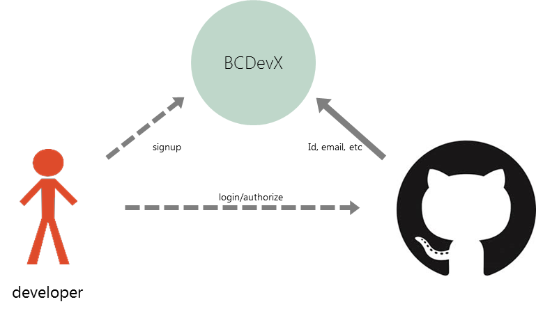
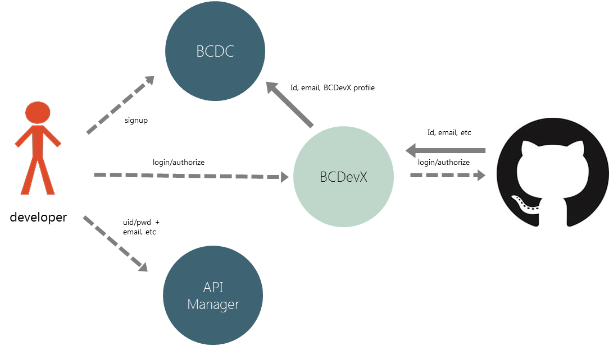

---
[Back to Discussion Index](../discussion_index.md)

##Developer Registration

In this document, we hope to describe the developer registration prototype in the following aspects:
* Purpose;
* Identity framework assessment;
* Source of credentials;
* Architecture;
* Processes;
* Integration technical notes;
* Target state considerations.

###Purpose of Developer Registration

What do developers need to do within BCDevExchange? The following are high-level reasons for developers to register in near term:

1.	Bi-directional communication
    1. Provide support
    1. Outage information
2.	Registering Applications for API Key Management
3.	Authorizing access to GitHub repositories and/or pull requests
4.	Creating a profile on BCDevExchange to market needs, projects and assets

Longer term:

1.	Certify individual and/or organizations
2.	Provide identity and/or certifications claims to participating BCDevExchange members

###Prototype

**Transactional Risk and Level of Assurance Assessment**	
The scope of this document and moreover the beginning stages of the prototype is limited to transactions that have a LOW level of risk. Therefore, the solution described here must meet a Level of Assurance Level 1 (LOA1) or greater. LOA1 does NOT require a verified identity record. However, it does require a credential of medium strength or greater, e.g., username and password.  

**Source of Credentials**
Since identity record of the individual is not of significance, we focus on the source of the credentials or even better authentication services.  Social logins have medium to strong credentials with self-asserted identity information.  GitHub is likely to meet the majority of the demographic BCDevExchange is targeting for the industry developers.  

https://developer.github.com/guides/basics-of-authentication/

**Architecture**
Logically, BCDevExchange is a separate organization from the B.C. Government. The B.C. Government is a major but not exclusive member of BCDevExchange. A developer may interact with one or more members of BCDevExchange. Provisioning could be automated, for example, registering with BCDevExchange would automatically provision identity to all members. In this scenario, privacy is not respected.  We favour user centric internet identity patterns.

Developers should be able to choose which other members they would like to have relationships with.  Participating BCDevExchange members, such as BCDC, will rely on BCDevExchange as authentication gateway and for the BCDevExchange profile. A BCDevExchange profile in the prototyping phase will be simple, “is member”.  We envision BCDevExchange profile will provide more substantial claims such as a BCDevExchange Certified Developer.  Furthermore, BCDevExchange as an identity provider and authentication gateway, BCDevExchange may be integrated with additional identity providers and authentication services such as BC Services Card. This increases the identity from LOA1 to LOA3 (high assurance identity).  

The following diagram depicts the information flow as a developer signs up to BCDevExchange. For technical readers, these are implemented using OAuth2.

The following diagram depicts the information flow as a developer signs up to BCDC. BCDC will rely on BCDevExchange as an authentication gateway and simple identity provider. And in turn, BCDevExchange will rely on GitHub for authentication services.  

The API Manager (WS02) cannot readily integrate with social logins. For prototyping purposes ONLY, we will require users create a username and password for the API Manager.  

 

Note: users are usually persistently logged onto GitHub so the credentials would not have to be re-entered.  

**BCDevExchange Registration Process**

The following describe a typical developer registration process within BCDevX:
1.	User navigates to bcdevexchange.org
2.	User clicks Sign Up from any page
3.	User is presented a screen that states a GitHub account is required
4.	User is redirected to GitHub
5.	User either creates a GitHub account or logs in with their existing account
6.	User views GitHub authorization page to allow BCDC access to their identifier, email address, etc
7.	User returns to BCDevExchange logged in
8.	BCDevExchange records a unique identifier, email address, etc
9.	BCDevExchange prompts user to fill or change their pre-populated profile

**BCDC Registration Process**	
As noted above, BCDC will require a registration process in addition to BCDevX. However, the same credentials they used on BCDevExchange would also be available, i.e., GitHub.

1.	User is logged on to BCDevExchange and navigates to BCDC
2.	User clicks Sign Up from any page
3.	User is presented a screen that states a BCDevExchange account is required
4.	User selects BCDevExchange login
5.	User is redirected to BCDevExchange
6.	BCDevExchange prompts user to sign in or sign up
7.	User selects sign in using GitHub
8.	User views GitHub authorization page to allow BCDC access to their identifier, email address
9.	User returns to BCDC logged in
10.	BCDC records a unique identifier, email address
11.	BCDC prompts user to fill or change their pre-populated profile

**Integration**
GitHub uses OAuth2 for its authentication service.  Because BCDevExchange and the B.C. Government (CKAN and WS02) are separate domains, we expect that two GitHub authorization events will occur.  

https://developer.github.com/v3/oauth/

**BCDevExchange Integration**
This app is custom built using AngularJS.  The backend has not been selected at the time of writing.  An OAuth2 library/services must be available for the selected backend platform.

**BCDC (CKAN) Integration**
CKAN, the underlying software for BCDC, does not have built-in OAuth2 support.  However, CKAN organization recognizes the following external for OAuth2:

https://github.com/conwetlab/ckanext-oauth2

**API Manager (WS02) Integration**
WS02 does not support OAuth2 out of the box.  It does support SAMLv2, but GitHub only provides OAuth2 support.  Therefore, for prototype purposes ONLY, the user will be required to create a username and password within WS02.
Target State Considerations

The above describes the prototype and not the end goal.  Here are considerations for target state:

1.	The B.C. Government’s Enterprise Security Gateway (ESG) integrates with social logins, and BC Services Card.
2.	BCDC uses the ESG to accept IDIR, BCeID, social logins and BC Services Card logins.  
3.	BCDC uses SAMLv2 for integration with ESG.
4.	Organization and other affiliation services become available.
5.	A developer certification member management certificate service becomes available.
6.	GitHub APIs are used to grant GitHub roles for certified developers.
7.	API Management integrates with ESG. 
