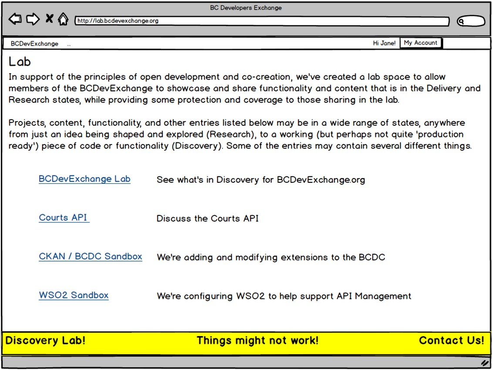

---
[Back to Discussion Index](../discussion_index.md)

#Lab

*Note: Lab should not be confused with current state lab.bcdevexchang.org as of March 2015*

**Release 1:** In support of the principles of open development and co-creation, it is proposed that the BCDevExchange website be enhanced to include a "lab" space. This lab area will allow members of the BCDevExchange to showcase and share functionality and content that is in the Delivery and Research states, while providing some protection and coverage to those sharing in the lab. The lab, and its contents, will all be clearly labeled as being in the lab, with disclaimers and desciptions of what that means. 

In addition to providing a location and framework for the BCDevExchange to share ideas, concepts, functionality, and content being considered for the BCDevExchange.org itself, the lab is also intended to support other, non-BCDevExchange projects, giving them a safe place to evolve and share. 

The lab functionality will only be available to users who have signed up with the BCDevExchange. In early days, the lab area may be further limited to select users or groups as the lab idea is further defined and refined. Users should be able to navigate between BCDevExchange and its lab area after logging in. When entering the Lab state, the site will provide a message warning to the user that they are entering the lab, provide any required disclaimers, an overview of the state concepts used in the lab, and possibly a ‘what’s new in the lab’ summary. 

When interacting with any project within the BCDevExchange lab, the current state of each project, page, resource, or function should be clearly displayed to the user at all times, through the display of the appropriate state tag (Research, Discovery, or Delivery). 

###Mockup

Several ideas are being considered for how the Lab concept will be handled. The below mockup shows a lab landing page, accessed via BCDevExchange, which would provide links to different things in the lab. 

In both solutions presented below, BCDevExchange would be considered a 'project' among other projects.  It would have a link to a lab version of BCDevExchange (currently located at lab.bcdevexchange.org).  

## Solution Option 1 ##

Create a very distinct separation of BCDevExchange.org from Lab area. 

### Use-case:

1. User navigates to bcdevexchange.org
2. User selects top level nav item 'Labs'
3. User see a page listing all labs

The existing BCDevExchange.org app could provide support use-case.   

### Benefits:
1. Very clear distinct of lab things

### Consequences:
1. Uncoupled from projects or people
2. Delivery or research things would need a place too 

A variant of the above solution could have the lab be a separate site and separate code base, using simpler technologies like Jenkins.  This would exclude some core functionality that BCDevExchange provides like sign-in.

## Solution Option 2 ##

Embed lab projects in BCDevExchange.org

### Use-case:

1. User navigates to bcdevexchange.org
2. User select top level nav item 'Projects', 'Resources'
3. User see all projects and resources in all three states (research, discovery, delivery)
4. User see a discovery project and any associated lab links

The existing BCDevExchange.org app could provide support use-case.   

### Benefits:

1. Labs are coupled to projects or resources
2. Single view for all states

### Consequences:

1. Single view for all states if not communicated clearly would lead higher expectations for things in research or discovery.

