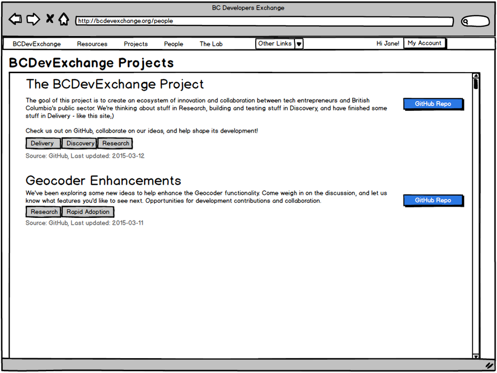

---
[Back to Discussion Index](../discussion_index.md)

##Projects

**Release 1:** BCDevExchange will support the concept of a Project, which is a record reflecting some sort of initiative, activity, or task that is occurring in the real world, and is presumably of some interest to the members of BCDevExchange. This is intended to allow people to share information of ongoing activities with the rest of BCDevExchange, and could include everything from a concept that people are looking to discuss, to an unmet business need looking for suggestions for a solution, to an active development activity (and using a [Project State](projectstates.md) to help indicate where it currently is). Not all Projects will have any kind of output. While some may produce some sort of usable digital resource, such as an application or piece of code, others may start and end in the Inspiration state, never changing to the Exploration or Delivery states. 

For early releases, we are using GitHub repos to support projects. Issues associated with the Project repo will be used to expose a project backlog, and related opportunities and needs.

###Projects and Business Needs

A number of business needs have been identified that we believe will be met through the use of Projects and Backlogs, with the solutions utilizing either one (either projects or backlogs) or both of these (projects and backlogs). As part of the proposed solutions,  the concept of labels and tags will be used, which is the idea of associating one or more tags / labels (pre-defined words or terms), which will assist both the system and its users in easily identifying and associating projects and backlogs with the business need they are helping to meet. 

The following business needs have been identified, and are intended to be addressed by the solutions proposed in this document:

1.	Pitch an Idea
  a.	Seeking a Technical Solution
  b.	Seeking a Business Solution
  c.	For general feedback from the community
2.	Post an Opportunity
  a.	With a defined scope (timeline, solution parameters)
  b.	With an identified exchange of value (credit, recognition, money?)
3.	Search on Opportunities 
  a.	Based on my skills
  b.	Based on my interests

###Need: Pitching an Idea

Pitching an idea is a pretty wide ranging concept, and could be anything from ‘what about this very specific technical solution to this very specific technical problem’ to ‘what thoughts do people have about a proposed solution to a somewhat vaguely defined but unmet business need’. An idea being pitched may result in one or more projects, or be just a small piece of a single project. Due to the varied nature of ideas, it seems like it would be difficult to nail down a single implementation option under which this business need would be met. Instead, it’s proposed that the framework of GitHub project repos and issues as a whole be used to support the need for pitching an idea. 

In short, the need of ‘Pitching an Idea’ can be met through creating / listing a project (project repo), or through the creation of an issue associated with a project (issue). For discoverability, it is proposed that specific tags be used to identify projects being used to ‘pitch ideas’, and issues use specific labels to identify ‘ideas being pitched’.

####Proposed Project Tags (Pitch an Idea)

Project tags will be identified as part of the project listing in the projects.yml. 
Open for Collaboration
Feedback Wanted
Input Wanted

####Proposed Issue Labels (Pitch an Idea)

Issue labels will be assigned via GitHub issues. 
Question

####Implementation Notes

To be completed once the above approach is confirmed.

###Need: Post an Opportunity

The business need of Posting an Opportunity is intended to provide a way for project owners to indicate that there is the opportunity for an exchange of value in the context of a project. This could be defined at a project level, where the project as a whole is perceived as a possible opportunity for developers or entrepreneurs to perform work or provide a solution, or at the Backlog / Issue level, where there is a more specifically, scoped out opportunity that is perhaps one of many opportunities associated with a project.

As part of the project or issue, the person proposing the opportunity would be expected to set expectations regarding scope, timeline, solution parameters, or any value being proposed for exchange. 

####Proposed Project Tags (Post an Opportunity)

Project tags will be identified as part of the project listing in the projects.yml.
Opportunity
Value Exchange

####Proposed Issue Labels (Post an Opportunity)

Issue labels will be assigned via GitHub issues. 
Help Wanted
Enhancement

####Implementation Notes

To be completed once the above approach is confirmed.

###Need: Search on Opportunities 

The business need of Searching on Opportunities is intended to provide a way for people (probably developers and entrepreneurs) to find opportunities which could result in an exchange of value, and specific to their skills and interests. This business need is intended to be met through enhancements to the BCDevExchange Project Search functionality.
The Search on Opportunities business need solution will leverage the same labels and tags proposed for the Post an Opportunity business need, as the Search need is performed against the data provided generated from Post need. 

####Implementation Notes

1.	Create new logic to display the languages associated with a project, based on the GitHub repo the project is located (specific implementation to be determined)
2.	Create new logic to display tags associated with each project returned by the Project Search. These will come from the new projects.yml file in GitHub (considered the source of truth), and fully moderated by the BCDevExchange team, so defining filters / permitted tags is unnessecary
3.	Create new logic to display specific Issue Labels for issues in a project’s backlog returned in the BCDevExchange Project Search (the specific labels should be driven by the labels defined in the context of the Pitching an Idea and Post an Opportunity business needs above). 
4.	As the query against GitHub Projects will be an explicit call to the projects.yml file in the BCDevExchange-Projects repo, there is no need to filter based on README.md tags or association with BCDevExchange accounts. The projects.yml file will be considered the source of truth for the following information displayed in the Project Search results on BCDevExchange: Title, Description, linked URL, Tags, and Source. However, the Backlog link, Issues count, Issue labels, and Languages information will not be stored in resources.yml, and will be pulled from the actual referenced repos themselves.
5.	Issue labels are configurable by repo, and can be user created and defined. In able to maintain moderation of the content on the Project Search page, we will need to explicitly define exactly which issue labels we will display on BCDevExchange Project Search results.
6.	GitHub has several default Issue labels. It is suggested that we leverage these existing labels, specifically ‘Help Wanted’, ‘Enhancement’, and ‘Question’. Leveraging existing labels is thought to be in line with several of the dev principles, but could be expanded to include BCDevExchange specific issue labels in the future if necessary. 

####Summary: Tagging guide

Provide a summary of project tags and issue labels used to meet the business needs listed above. To be completed once the above approach is confirmed.

##Notes
**Future State:** Like resources, projects are created in the context of a specific [profile](profiles.md) (either against an Individual profile or Organization profile). Unlike Resources, but like [Organizations](organizations.md), projects can be owned and shared by multiple users (against a specific profile), with certain profiles having different rights to maintain the project. Like organizations, users can be invited to a project (at the profile level), or can request an invite to the project (at the profile level). Users who are not part of a project can still sign up to follow a project, to receive notifications of updates.  

Within the context of a project, users can create posts to share with BCDevExchange community as a whole, or only to users associated with the project, and respond to those posts. Projects may also link to related sites, such as GitHub repos or forums outside of BCDevExchange.  

Projects may be related to one or more BCDevExchange resources, with the same Resource possibly being associated with multiple Projects, and identified via the same pool of metadata tags that are used to define resources. BCDevExchange would facilitate searching on projects similar to resources. Projects can also be related to other Projects, and to one or more Organizations. 

###Mockup

